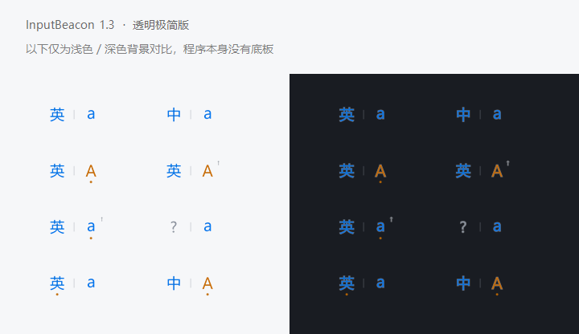
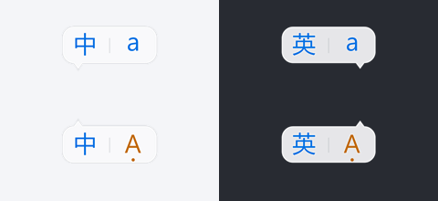
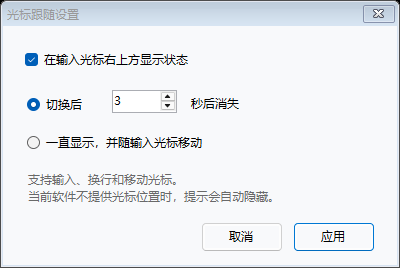
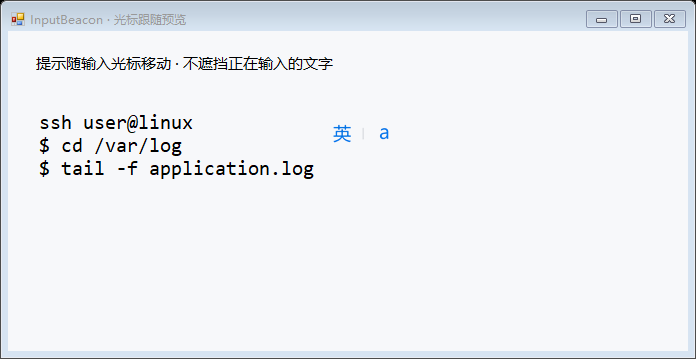
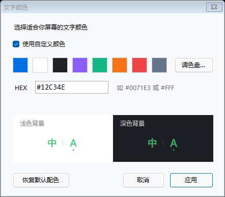

# 键盘状态 · InputBeacon

轻量的 Windows 输入状态提示工具。在浏览器终端、SSH 客户端或编辑器里输入时，直接看见当前的 **中 / 英** 和 **A / a**。

单文件 EXE，双击运行。提供透明悬浮窗、任务栏通知区域状态，以及输入光标旁的跟随气泡。三种显示方式可独立开启或同时使用。当前版本：**1.4.3**。

开启光标跟随并设置消失秒数后，在不同输入框间切换，即会显示当前状态并重新计时；原有偏好沿用。升级请先退出旧版，再运行新版 EXE。

**[下载最新版本](https://github.com/LiguoXia/InputBeacon/releases/latest)** · [版本记录](CHANGELOG.md) · [反馈问题](https://github.com/LiguoXia/InputBeacon/issues)



图中的背景用于对比；固定悬浮窗本身没有背景板。光标跟随使用下方所示的浅色半透明气泡。

## 下载与开始使用

1. 打开本仓库的 **[Releases](https://github.com/LiguoXia/InputBeacon/releases/latest)**，选择最新版本。
2. 下载 **[InputBeacon.exe](https://github.com/LiguoXia/InputBeacon/releases/latest/download/InputBeacon.exe)**，或下载 **[便携 ZIP](https://github.com/LiguoXia/InputBeacon/releases/download/v1.4.3/InputBeacon-v1.4.3-portable.zip)** 后解压。便携包内的可执行文件名为 `键盘状态.exe`，与单独下载的 EXE 内容相同。GitHub 自动生成的 `Source code` 是源码，普通使用无需下载。
3. 双击 EXE。第一次运行默认显示悬浮窗；任务栏状态、光标跟随和开机启动默认关闭。
4. 点击终端输入区，再切换中英文、Caps Lock 或 Shift，观察提示。
5. 右键悬浮文字或通知区域图标，调整设置。

运行环境：Windows 10 / 11，安装有 **.NET Framework 4.8**。EXE 为 AnyCPU，可在相应的 32 位或 64 位 .NET Framework 环境运行，ARM 设备未验证。普通使用无需管理员权限、安装器、.NET SDK 或网络连接。若缺少 .NET Framework 4.8，请使用 Microsoft 官方安装程序补齐。

发布文件暂未做代码签名。下载后可以核对 Release 附带的 SHA-256 校验值。

## 看懂状态

| 标记 | 含义 |
| --- | --- |
| `中` | 当前 Windows 输入法处于中文模式 |
| `英` | 当前 Windows 输入法处于英文模式 |
| `?` | 当前窗口未提供可读取的输入法状态 |
| `A` / `a` | 按常规英文字母键计算的大写 / 小写状态 |
| 字母下的小圆点 | Caps Lock 已开启 |
| 小箭头 `↑` | Shift 正被按住，大小写临时反转 |
| 中 / 英下的小圆点 | 输入法报告全角模式 |

例如 Caps Lock 开启时显示 `A`；同时按住 Shift 则显示 `a`，Caps Lock 圆点仍保留。鼠标停在固定悬浮文字上，可查看详细状态。其他语言的键盘布局不会被强行标为中文或英文。

## 三种显示方式

### 透明悬浮窗

右键 → **显示悬浮窗**，控制固定位置提示。

- 默认尺寸为 84 × 36 逻辑像素，提供 80%、100%、125%、150% 大小选项，并随 Windows DPI 缩放。
- 背景完全透明，没有黑底、外框或硬边裁切。文字采用四倍分辨率绘制后缩小，保留平滑透明边缘。
- 在文字上按住左键拖动，即可调整位置。
- **鼠标穿透**开启后，文字也不拦截点击；从通知区域菜单取消穿透即可再次拖动。
- **重置位置**把悬浮窗放回鼠标所在屏幕的右上方。

透明空白处不接收鼠标操作，拖动和右键时请对准文字。

### 任务栏状态

右键 → **任务栏显示状态（中/英 · A/a）**。

这里的任务栏指 Windows 底部任务栏右侧的**通知区域**。开启后显示两个原生图标，分别显示中英文与大小写，不占用应用程序任务栏按钮的位置。

Windows 可能把首次出现的图标收进 `^` 隐藏区域。把两个图标拖到任务栏上即可常显，也可拖动调整次序。两个图标均支持右键设置；双击任一图标可隐藏或显示固定悬浮窗。

即使关闭所有状态显示，通知区域仍保留一个软件图标，方便恢复设置或退出。


### 光标跟随气泡

右键 → **跟随显示设置…**，勾选“在输入光标右上方显示状态”，选择时长后点击**应用**。也可通过菜单中的**光标跟随显示**快速开关。

| 方式 | 行为 |
| --- | --- |
| 切换后若干秒消失 | 进入另一个输入框、中英文或大小写状态变化时出现，可设 **1～60 秒**，默认 **3 秒**；显示期间也会跟随光标移动 |
| 一直显示 | 能读取当前输入光标时持续显示；输入、换行和移动光标时同步调整位置 |

提示通常位于光标右上方；气泡小尖角距离光标约 4 个逻辑像素，比旧版更贴近。标准尺寸为 **72 × 34** 逻辑像素，带浅色半透明底、圆角、细边和柔和阴影，使用四倍分辨率渲染平滑边缘。接近屏幕右边缘时移到左侧，接近顶边时移到下方。跟随提示始终鼠标穿透，不抢键盘焦点。



定时模式下，进入输入框后显示一次当前状态；从浏览器搜索框切换到微信输入框，即使中英文和大小写没变也会显示。从另一个输入框切回来也会重新计时。1.4.3 取消跨应用 / 原生输入控件切换时额外的 200 ms 等待，首次读到有效光标和已知输入状态就显示。共享同一窗口的虚拟输入框再确认一次轮询，通常约 100 ms，以过滤单次控件标识波动。实际响应还取决于轮询时机和目标应用提供光标的速度。倒计时从确认显示时开始，因此接口较慢也不会耗掉显示时长。同一框内打字、移动光标不会续时；光标短暂丢失后在同一框恢复也不会再次弹出。设置在下次启动时保留。

软件使用窗口 / 控件句柄与可获取的 UI Automation 控件标识区分输入框，不读取输入文本。未提供独立控件标识的自绘输入框，在同一窗口内切换时可能无法区分；未获得可靠光标或中英文状态时不会猜测显示。

**1.4.1 的防误触发规则：**中英文变化需连续稳定至少 200 ms 才弹出气泡；实际 A / a 变化仍在下一次轮询时提示。短暂的 `?`、读取失败后的恢复、全角标记波动，以及 Caps / Shift 组合变化但 A / a 没变，都不会触发或延长提示。此修复针对微信使用微软拼音时报告的误弹路径；固定悬浮窗与任务栏仍正常刷新状态。“一直显示”不受此触发过滤影响。

**跟随的是文本插入光标，不是鼠标指针。** 软件未提供可靠光标位置、失去可用输入光标，或正在操作本工具的菜单、设置对话框时，提示会隐藏。程序不会根据鼠标位置猜测光标位置。





上图是本地测试输入框与实际渲染器合成的效果预览，不代表所有浏览器或 SSH 客户端都提供相同的光标接口。

## 文字颜色与外观

右键 → **文字颜色…**。

- 支持预设色和 Windows 系统调色盘。
- HEX 支持 `#0071E3`、`0071E3`、`#FFF`，大小写均可；短格式展开为六位颜色。
- 非法色值不能应用；点击**应用**才保存，**取消**保留原设置。
- 自定义颜色同步应用到悬浮窗、任务栏状态和跟随提示。
- **恢复默认配色**后点击应用，可恢复默认蓝色与大写状态的橙色。
- **文字不透明度**影响固定悬浮窗和跟随提示；通知区域图标不应用这一整体透明度。



## 常用操作

| 操作 | 方法 |
| --- | --- |
| 调整显示方式 | 右键，分别勾选悬浮窗、任务栏状态、光标跟随 |
| 只用光标跟随 | 开启光标跟随，关闭悬浮窗与任务栏状态 |
| 找回固定悬浮窗 | 再次双击 EXE，恢复现有实例的悬浮窗并取消鼠标穿透 |
| 自动启动 | 右键 → 开机启动；移动 EXE 后请关闭再开启该项 |
| 退出 | 右键 → 退出 |
| 升级 | 先退出旧版，再替换 EXE；已有偏好保留，新增跟随功能默认关闭 |
| 卸载 | 先关闭开机启动，退出程序，再删除 EXE；需要清除偏好时删除设置文件夹 |

没有全局快捷键，不会占用终端快捷键。重复双击不会启动多个实例。

## 浏览器、SSH 与兼容性

先点击浏览器终端、网页输入框或 SSH 客户端的输入区域。本工具读取**本机 Windows 前台窗口**的输入法与按键状态，无法读取远端 Linux、网页自建输入法、虚拟机或远程桌面内部独立维护的模式。

中英文状态取决于输入法的 Windows IME 兼容接口。第三方输入法、特殊 TSF 模式或高权限窗口可能不提供状态，也可能返回陈旧状态。`?` 表示读取失败；API 返回成功并不等于所有第三方输入法都已验证准确。

Windows 光标位置尝试 Win32 原生插入光标、MSAA 辅助功能光标、原生 UI Automation **TextPattern2 / GetCaretRange** 和旧版文本范围。1.4 补充现代资源管理器输入框的光标接口、跨进程宿主识别和系统 MSAA 光标回退。1.4.1 在空光标范围时尝试相邻字符的几何位置，避免该回退将空行定位到上一行；开启跟随后，提示隐藏期间也保持后台定位连接，改善短倒计时的首次显示。浏览器普通输入框、网页终端、Canvas 自绘终端和不同 SSH 客户端提供的接口可能不同。只绘制画面且不提供光标几何信息的终端，跟随提示可能无法显示，此时可继续使用固定悬浮窗和任务栏状态。

### IntelliJ IDEA / Java 编辑器

IDEA 的 Java 编辑区通过 **Java Access Bridge** 提供光标位置。普通 Windows 文本接口可能只看到外层窗口。

1. 先打开 IDEA，然后右键 InputBeacon 通知区域图标 → **IDEA / Java 光标支持…**。
2. 点击 **启用 Java 光标支持**。软件调用 IDEA 自带运行环境的 `jabswitch -enable`，启用当前用户的 Java 辅助接口。
3. 保存工作，完全退出并重新打开 IDEA，再到编辑区输入、换行和移动光标。
4. 如果仍没有提示，在 IDEA **设置 → 外观与行为 → 外观**中开启 **支持屏幕阅读器 / Support screen readers**，应用设置。不同 IDEA 版本的菜单文字可能不同。
5. 确认 InputBeacon 的光标跟随已开启，可先选择“一直显示”进行检查。

启用桥接通常只需一次。软件不会自动重启 IDEA，也不会修改项目文件。运行时使用 Java 应用自带的桥接 DLL，不捆绑 Java；未找到兼容桥接运行环境时，设置会提示先打开 IDEA。当前验证使用 64 位 JetBrains Runtime，32 位与不同厂商运行环境仍需验证。

程序不会修改浏览器启动参数或辅助功能设置。目标应用以管理员权限运行时，普通权限程序可能读不到状态；确有需要时可让两者使用相同权限。安全桌面、独占全屏和特殊远程环境不保证显示。

**验证范围：**本地自动检查覆盖模式解析、设置保存、颜色、透明合成、通知区域图标、跟随计时与边缘避让、真实 WinForms TextBox 光标和原生 UIA COM 连接，以及跟随窗口不改变前台焦点。1.4.1 增加未知状态恢复、短暂中英跳变、焦点变化、轮询暂停、有效大小写不变和空 UIA 范围的回归检查。另在 IDEA 2024.1.7 所带的 64 位 JetBrains Runtime 上，通过独立 Java 输入框验证水平移动、换行、文末、空文本及恢复输入，共 6 个阶段。1.4.2 共通过 173 项自动检查，新增进入输入框的计时、跨应用与虚拟控件切换、抗波动以及真实 UIA 控件标识检查。1.4.3 共通过 176 项自动检查，补充首次有效采样立即提示、下一轮确认和完整倒计时的检查。不同浏览器 / 微信版本、IDEA 编辑区和资源管理器输入框的实际组合仍需分别验证；自动检查通过不等于所有组合都适配。

## 常见问题

**看不到任务栏状态？** 确认已开启，再展开 `^` 隐藏区域，把图标拖出来。

**中 / 英一直是问号？** 确认输入区获得焦点，并检查客户端权限。仍有问题时右键选择**复制状态诊断**，提供客户端、输入法名称和复现步骤。诊断不包含输入文本或窗口标题。

**没有跟随提示？** 确认已启用；定时模式下，切换到另一个可识别输入框，或切换中英文 / 大小写会重新显示。可改为“一直显示”检查。若固定状态正常但跟随不出现，通常是应用未提供可用光标位置。

**提示很快消失？** 定时模式按最后一次状态变化计时，移动光标不延时。可增加秒数，或选择“一直显示”。

**微信里未切换也突然弹出？** 1.4.2 中，进入不同输入框会主动显示一次，这是预期行为；继续在同一输入框打字则不应反复弹出。状态读取失败及恢复、全角波动仍不触发。若异常重复出现，右键 → **复制状态诊断**，附上微信和输入法版本、出现时的操作。`Input field focused` 表示输入框进入提示；诊断不含聊天内容。

**浅色文字看不清？** 固定悬浮窗没有背景板；跟随气泡使用浅色半透明底。可以选择深色文字或恢复默认蓝色配色。

**A / a 与实际输入不同？** 显示依据常规字母键的 Caps Lock 与 Shift 组合。应用、输入法或远端键盘重映射可能改变实际输出。

## 设置、隐私与权限

设置保存在：

```text
%LOCALAPPDATA%\InputBeacon\settings.ini
```

关闭程序后删除此文件，可恢复默认设置。文件只保存显示位置、大小、颜色、透明度和显示偏好，不保存输入内容。

程序不联网、不记录或读取输入文本、不安装全局键盘钩子、不注入目标进程，也不更改输入模式。辅助功能接口只用于光标几何位置、索引和输入控件标识。用户开启“开机启动”时写入当前用户的 Windows `Run` 启动项；点击“启用 Java 光标支持”时，Java 自带工具会更新当前用户的 `.accessibility.properties` 及相关 Java 辅助功能配置。复制状态诊断包含定位接口结果，不包含输入文本或窗口标题。

## 从源码构建

在 Windows PowerShell 中进入项目目录，运行：

```powershell
.\build.ps1 -Test
```

使用系统 .NET Framework C# 编译器及 WinForms、System.Drawing、Accessibility、UI Automation 程序集，不下载 NuGet 包，不依赖 Visual Studio 或 .NET SDK。

```text
release/键盘状态.exe       可直接运行的程序
release/使用说明.txt       离线说明
test-output/results.txt   检查结果
test-output/*.png         外观与设置预览
```

可指定输出目录，避免覆盖正在运行的 EXE：

```powershell
.\build.ps1 -Test -OutputDirectory .\build\candidate
```

自测会短暂创建本工具的测试窗口，不修改用户偏好或真实输入法开关。`test-browser.html` 是不联网的手动检查页；打开后依次检查中英文、Caps Lock、Shift、输入、换行和移动光标，再到实际终端重复验证。

如果安装了包含 `javac.exe` 的 64 位 Java 运行环境，可额外运行真实 Java 桥接检查：

```powershell
.\tests\test-java.ps1 -RuntimeBin 'C:\路径\IDEA\jbr\bin'
```

测试仅为自己创建的 Java 窗口启用桥接，不修改用户的全局 Java 设置；自动关闭测试窗口，结果写入 `test-output/java/java-results.txt`。

人工检查光标位置和触发原因时，可构建独立测试面板：

```powershell
.\tests\build-live-preview.ps1
.\build\live-test\InputBeacon-preview.exe
```

勾选“持续显示”检查输入、换行和光标移动；取消勾选可检查 1 秒定时提示。面板显示最近的光标坐标、输入状态和触发计数，不读取输入文本，也不修改已保存的显示偏好。测试结束后关闭面板即可。

生成一次状态诊断：

```powershell
.\release\键盘状态.exe --diagnose "$env:TEMP\inputbeacon-diagnostic.txt"
```

该命令读取执行时的前台窗口；排查某个终端时，使用通知区域菜单的“复制状态诊断”更方便。

| 源码 | 用途 |
| --- | --- |
| `Program.cs` | 入口、单实例、诊断与自测命令 |
| `InputState.cs`、`Native.cs` | 输入模式、Caps / Shift、原生调用 |
| `Overlay.cs`、`StatusTray.cs` | 固定悬浮窗、通知区域、菜单 |
| `CaretTracker.cs`、`AutomationCaret.cs`、`JavaCaret.cs` | Windows / UIA / Java 光标几何位置 |
| `CaretOverlay.cs`、`BubblePainter.cs` | 跟随计时、位置与圆角气泡 |
| `JavaSupportForm.cs` | Java 桥接启用入口 |
| `CompactPainter.cs`、`LayeredSurface.cs` | 平滑文字与逐像素透明合成 |
| `*Settings*.cs`、`ColorValue.cs` | 偏好保存、颜色和跟随设置 |
| `SelfTests.cs`、`FollowTests.cs` | 自动检查和界面预览 |

源文件位于 `src/`。约每 100 ms 轮询一次状态，IME 查询设置超时；MSAA / UI Automation 与 Java 桥接分别使用后台线程，Java 线程持续处理桥接消息，过期位置丢弃。退出时不等待无响应的外部辅助功能提供者。

Java 和现代文本接口参考：[Oracle Java Access Bridge](https://docs.oracle.com/en/java/javase/17/access/java-access-bridge-api.html)、[JetBrains 辅助功能设置](https://www.jetbrains.com/help/idea/accessibility.html)、[Microsoft GetCaretRange](https://learn.microsoft.com/en-us/windows/win32/api/uiautomationclient/nf-uiautomationclient-iuiautomationtextpattern2-getcaretrange)、[MoveEndpointByUnit](https://learn.microsoft.com/en-us/windows/win32/api/uiautomationclient/nf-uiautomationclient-iuiautomationtextrange-moveendpointbyunit)。

实现参考 Microsoft 文档：[GetGUIThreadInfo](https://learn.microsoft.com/en-us/windows/win32/api/winuser/nf-winuser-getguithreadinfo)、[ImmGetDefaultIMEWnd](https://learn.microsoft.com/en-us/windows/win32/api/imm/nf-imm-immgetdefaultimewnd)、[UpdateLayeredWindow](https://learn.microsoft.com/en-us/windows/win32/api/winuser/nf-winuser-updatelayeredwindow)、[TextPatternRange.GetBoundingRectangles](https://learn.microsoft.com/en-us/dotnet/api/system.windows.automation.text.textpatternrange.getboundingrectangles)、[UI Automation 线程说明](https://learn.microsoft.com/en-us/dotnet/framework/ui-automation/ui-automation-threading-issues)。

版本变化见 [CHANGELOG.md](CHANGELOG.md)。
