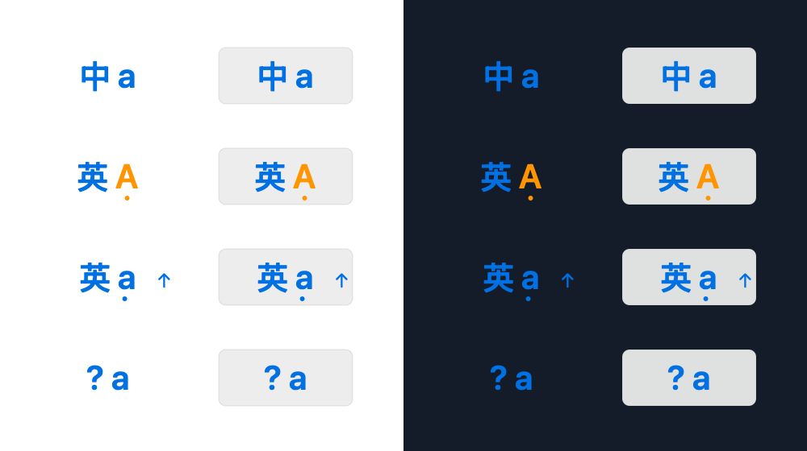

# 键盘状态 · InputBeacon for macOS

基于 Windows 1.4.4 的交互与跟随计时逻辑实现的原生 Swift / AppKit 版本。当前版本 **1.1.0**，新增搜狗及鼠须管内部中英文状态查询。支持 **macOS 13 Ventura 或更高版本**，Universal 2 程序包含 **Intel x86_64 和 Apple Silicon arm64**，无需 Rosetta、.NET 或其他运行时。



上图由实际绘制代码在 macOS CI 生成，用于展示浅色 / 深色背景上的文字与气泡；并非第三方应用兼容性截图。

## 安装

1. 从 [macOS 1.1.0 发布页](https://github.com/LiguoXia/InputBeacon/releases/tag/macos-v1.1.0) 下载 `InputBeacon-macOS-1.1.0-universal.dmg`。
2. 打开 DMG，将 InputBeacon 拖入 Applications（应用程序），弹出 DMG 后从应用程序启动。ZIP 版解压后同样移动到应用程序。
3. 首次运行显示透明悬浮窗，菜单栏保留 `⌨` 设置入口。
4. 开启“光标跟随显示”时，按提示在“系统设置 → 隐私与安全性 → 辅助功能”中允许 InputBeacon。固定悬浮窗与菜单栏状态无需此权限。

此版本使用临时（ad-hoc）签名，**未使用 Apple Developer ID 签名、未公证**。Gatekeeper 可能阻止首次打开。核对仓库来源及 `SHA256SUMS.txt` 后，可通过“系统设置 → 隐私与安全性 → 仍要打开”允许此应用。受组织管理的 Mac 可能不允许使用未公证应用。不要关闭系统整体安全保护。参考 [Apple：打开未知开发者的 Mac App](https://support.apple.com/guide/mac-help/mh40616/mac)。

## 功能与操作

- **透明悬浮窗**：拖动调整位置，右键设置；支持鼠标穿透、重置位置、80%～150% 大小及 45%～100% 不透明度。
- **菜单栏状态**：可显示“中 / 英 / 语 / ?”及“A / a”，关闭后仍保留设置入口。
- **输入光标跟随**：始终穿透，不抢焦点。进入新的输入框或实际大小写变化时显示；中英文状态变化需稳定 200 ms，包括搜狗 / 鼠须管在同一个输入源内切换。支持一直显示，或 1～60 秒后隐藏，默认 3 秒。同一框内打字、移动光标不会续时。
- **颜色**：支持 3 位 / 6 位 HEX，自定义颜色同步应用到悬浮窗、菜单栏状态和跟随提示，可恢复默认配色。
- **登录启动**：通过 macOS 的登录项管理启用；建议先将应用放入 Applications。
- **诊断**：菜单“复制状态诊断”包含版本、输入源 ID / bundle / 语言、状态来源、第三方查询结果与回复次数、修饰键状态、辅助功能权限与跟随触发原因，不包含输入文本。

大小写按 Caps Lock 与 Shift 异或计算。小圆点表示 Caps Lock 开启，↑ 表示按住 Shift。应用、输入法或键盘映射可能改变实际输出。

## 第三方输入法兼容

1.1.0 修复旧版仅根据输入源语言显示“中 / 英”的局限。搜狗按 Shift 切换时输入源 ID 通常不变，现在通过输入法自身的本地状态查询读取内部模式，不统计按键、不猜测 Shift 切换次数，也不要求安装搜狗切换助手。

| 输入法 | 中英文状态来源 |
| --- | --- |
| 搜狗 | 本地状态查询；处理中文、英文、自动英文和 Caps 英文状态；集成检查使用 6.25.1.11973 |
| 鼠须管 / Squirrel | `SquirrelGetASCIIModeNotification` 查询；需要安装版本实现该接口，老版本可能无回复 |
| 系统输入法及其他第三方输入法 | 系统输入源语言；不保证识别尚未适配的第三方内部中英文切换 |

切换到搜狗或鼠须管后自动查询，无需额外开关。约每 200 ms 查询一次，在原有 100 ms 界面刷新和中英文稳定确认后更新提示。查询状态本身不需要辅助功能权限；**光标跟随仍需辅助功能权限**。进入不同应用时丢弃之前确认的状态并重新查询。

刚进入输入法、回复超时、协议不支持时会显示 `?`；不会把搜狗名称直接当作“正在输入中文”。超过 750 ms 的状态不可继续使用。若一直为 `?`，确认输入框获得焦点、输入法正常运行，然后复制状态诊断并提供搜狗 / 鼠须管版本。`ThirdPartyQuery=confirmed` 表示收到有效回复，`timeout` 表示未及时收到，`unsupported-reply` 表示无法解析回复。

第三方接口可能随输入法版本变化；并非所有搜狗历史版本和其他第三方输入法都已验证。当前不显示全角状态。接口依据与测试方式见 [第三方适配说明](docs/third-party-input.md)。

## 与 Windows 版的差异

跟随定位使用 macOS Accessibility 的选区索引与零长度范围几何信息，不读取输入文本。选中文本、安全输入框、自绘终端、未公开插入光标几何信息的网页 / 应用不显示跟随提示，也不使用鼠标位置或整个输入框猜测光标。Java / IDEA 是否支持取决于其 macOS 辅助功能实现；Windows Java Access Bridge 不适用于此平台。

辅助功能调用在串行后台队列执行，带超时且不会堆积请求。旧样本超过 350 ms 或前台应用变化即失效；约每 100 ms 刷新。界面采用原生 Retina 绘制，无键盘事件监听器、无网络请求、不记录输入内容。

## 偏好与卸载

偏好使用 `UserDefaults`，域名 `com.liguoxia.InputBeacon`，独立于 Windows 偏好。卸载前关闭“登录时启动”，退出应用，再删除应用。需重置偏好时，退出应用后运行：

```sh
defaults delete com.liguoxia.InputBeacon
```

## 从源码构建

需要 Mac 及支持 Swift 5.9+ 的 Xcode / Command Line Tools。无第三方依赖。

```sh
cd macos
swift test
bash build.sh
```

`dist/` 包含 Universal `.app`、DMG、ZIP 与 SHA-256 校验文件。构建脚本分别编译 arm64 / x86_64，再使用 `lipo` 合并并验证两个切片，临时签名后生成安装包。

GitHub Actions 在 Apple Silicon 和 Intel macOS runner 上分别执行核心与通知接收器测试、双架构编译、签名校验和本机启动检查，另外检查真实搜狗进程的只读查询回复。推送 `macos-v*` 标签时，在这些检查通过后发布安装包，不改变 Windows 最新版标记。

自动化检查覆盖大小写、输入源语言、输入框切换、未知状态、200 ms 防抖、轮询暂停、定时隐藏和多显示器坐标 / 边缘避让。CI 的 `--self-check` 只确认二进制可执行，不等于实际用户会话中已验证辅助功能、输入法或登录启动。发布前后可使用 [人工验收清单](QA.md) 进行真实 Mac 验证。

首次发布的 [双架构验证记录](https://github.com/LiguoXia/InputBeacon/actions/runs/36504913042)：Intel / Apple Silicon 均通过 18 项核心测试、Universal 双切片检查、签名校验、本机执行与 AppKit 菜单 / 非激活窗口启动检查，并生成可检查的渲染图。实际执行环境为 macOS 15.7.9；macOS 13 是编译部署目标，尚未在 macOS 13 真机上验收。

接口依据：[Apple Accessibility](https://developer.apple.com/documentation/applicationservices/axuielement)、[AX 调用超时](https://developer.apple.com/documentation/applicationservices/1459345-axuielementsetmessagingtimeout)、[SMAppService](https://developer.apple.com/documentation/servicemanagement/smappservice)。
